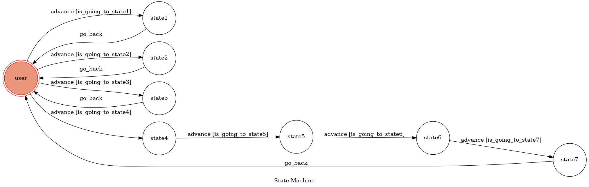

# TOC Project 2019

## function
* provide positive sentence(state1)
* provide food choice(state2)
* provide drink choice(state3)
* simple dialog(state4~7)

### first : stay positive!
input "positive" and the bot will reply a positive sentence

process : input "positive"
          reply "cheer up","never give up"...(randomly select one)

### second : help you to decide what to eat!
input "hungry" and the bot will reply a kind of food

process : input "hungry"
          reply "KFC","noodle"...(randomly select one)

### third : help you to decide what to drink!
input "drink" and the bot will reply a kind of drink

process : input "drink"
	  reply "tea","juice"...(randomly select one)

### forth : dialog
process : input "hello" , reply "hi"(state4)
	  input "nice to meet you" , reply "nice to meet you,too"(state5)
	  input "how are you today" , reply "fine"(state6)
	  input "bye" , reply "bye"(state7)

## Finite State Machine

